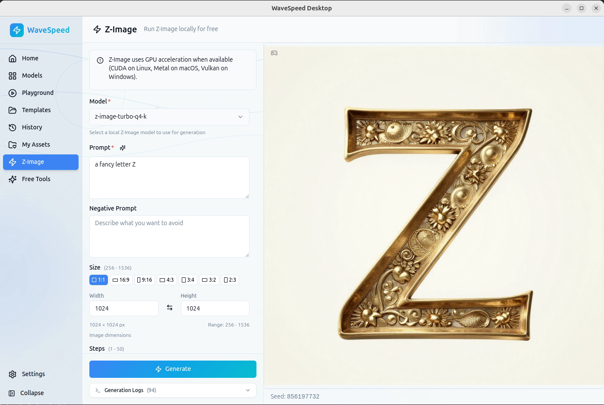

# WaveSpeed Desktop CUDA Binaries

Pre-built stable-diffusion.cpp binaries with CUDA support for Linux.



## For WaveSpeed Desktop Developers

See [DEVELOPER-GUIDE.md](DEVELOPER-GUIDE.md) for detailed instructions on:
- Fixing Linux sandbox crash on Ubuntu 24.04
- Fixing libstable-diffusion.so not found error
- Fixing Application Launcher not working
- Fixing desktop icon showing as generic
- Adding CUDA support to the official release
- GitHub Actions workflow for building CUDA binaries

See [tchung-changes.txt](tchung-changes.txt) for a summary of all changes.

## Download

Download the latest binaries from [Releases](https://github.com/tchung1970/wavespeed-desktop-cuda/releases).

## Files

- `sd-cli` - Command-line image generation tool
- `sd-server` - Server for image generation

## System Requirements

- Ubuntu 24.04 (or compatible)
- NVIDIA GPU with CUDA support
- NVIDIA driver 580+ with CUDA 12.0+

## Installation

1. Install WaveSpeed-Desktop-linux-amd64.deb from Releases
2. Download binaries (sd-cli, sd-server) from Releases
3. Copy to WaveSpeed Desktop sd-bin directory:

```bash
mkdir -p ~/.config/wavespeed-desktop/sd-bin
cp sd-cli sd-server ~/.config/wavespeed-desktop/sd-bin/
cp sd-cli ~/.config/wavespeed-desktop/sd-bin/sd
chmod +x ~/.config/wavespeed-desktop/sd-bin/sd*
```

## Build from Source

If you need to rebuild for your system:

```bash
sudo apt install nvidia-cuda-toolkit
git clone --recursive https://github.com/leejet/stable-diffusion.cpp /tmp/sd-cpp
cd /tmp/sd-cpp && mkdir build && cd build
cmake .. -DSD_CUDA=ON
cmake --build . --config Release -j$(nproc)
```

Binaries will be in `/tmp/sd-cpp/build/bin/`

## Version Info

- stable-diffusion.cpp: master-447-ccb6b0a
- CUDA Toolkit: 12.0
- Built on: Ubuntu 24.04 x86_64
